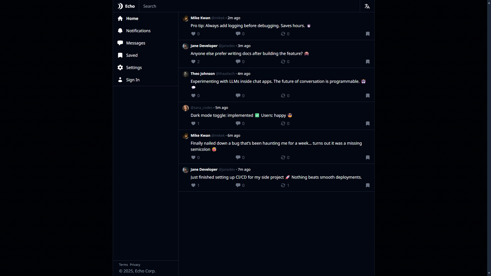
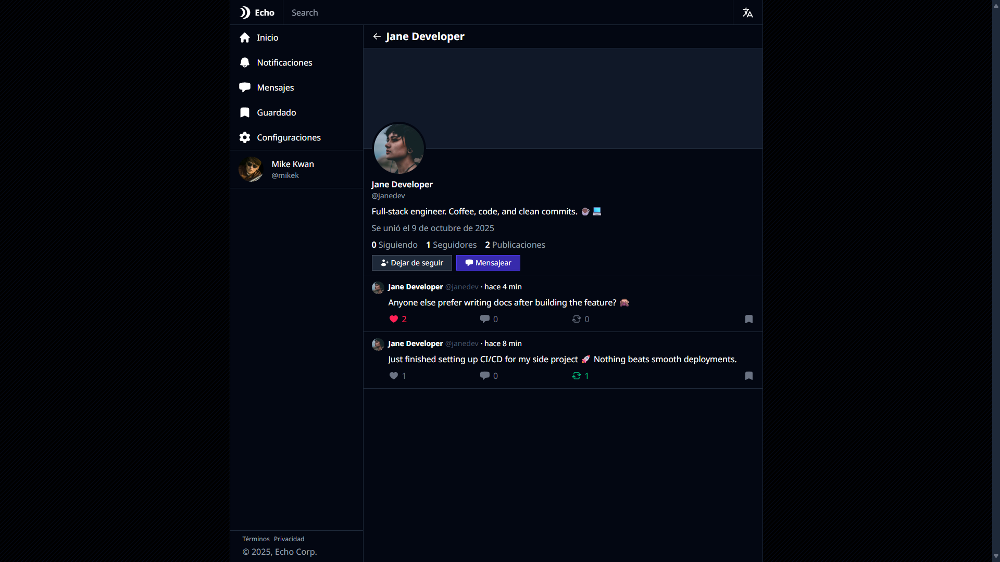
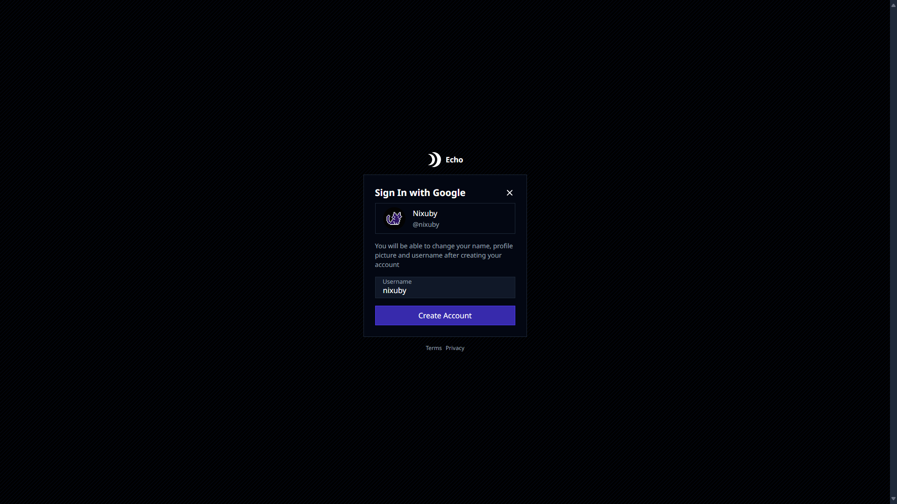

# echo

this is an application inspired by twitter, built to showcase fullstack development skills

this project is for educational and portfolio purposes only. it is not affiliated or intented to replace any existing social platform

## features

* user authentication with classic username-password and modern Google OAuth options
* post feed with infinite querying
* post creation, likes, reposts, and saves
* chat with message polling
* follower/following system
* internationalization - the app is available in English and Spanish
* responsive UI
* rest api

## stack

* **frontend**: react, typescript, tailwind, redux
* **backend**: node.js, express, prisma
* **database**: sqlite
* **auth**: passport.js

## install

1. clone the repository: `git clone https://github.com/nixuby/echo.git`
2. change directory: `cd echo/client`
3. install client dependencies: `npm i`
4. change directory: `cd ../server`
5. install server dependencies: `npm i`
6. apply Prisma migrations: `npx prisma migrate dev`
7. change directory: `cd ../shared`
8. install server dependencies: `npm i`
9. set environment variables in `./client/.env.local` and `./server/.env`

### environment variables

#### client

* **VITE_ENV**: environment - `development` or `production`.
* **VITE_API_URL**: api url. Example: `http://localhost:5179/api`
* **VITE_DEV_SERVER_HOST**: development server host. Example: `localhost`
* **VITE_DEV_SERVER_PORT**: development server port. Optional (default: `5173`)
* **VITE_GOOGLE_OAUTH_URL**: google oauth url

#### server

* **DEV**: is development environment? Optional (default: `false`)
* **HOST**: server host. Example: `localhost`
* **PORT**: server port. Optional (default: `5179`)
* **PW_HASH_SEED**: password hash seed
* **SESSION_SECRET**: session secret
* **CORS_ORIGINS**: comma-separated list of allowed origins

## screenshots

### home page

### user profile page

### google oauth initial sign in

